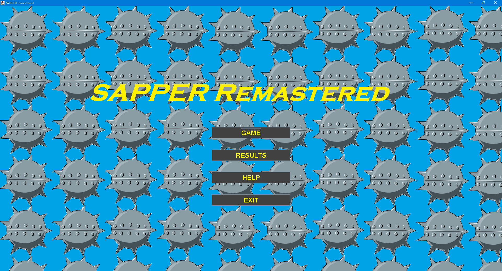
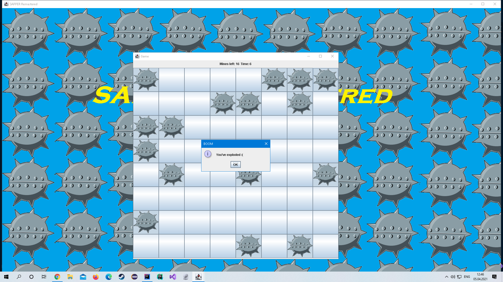
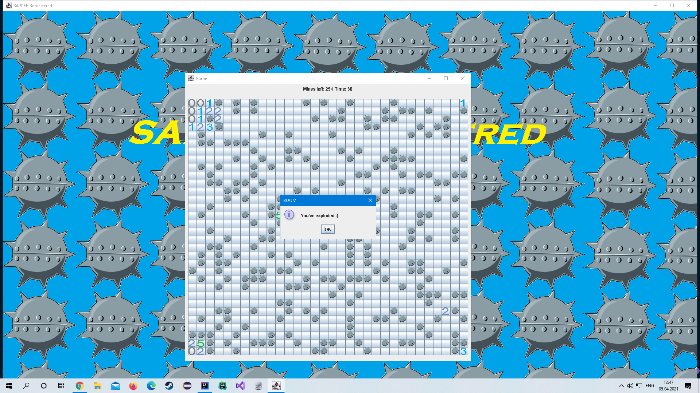
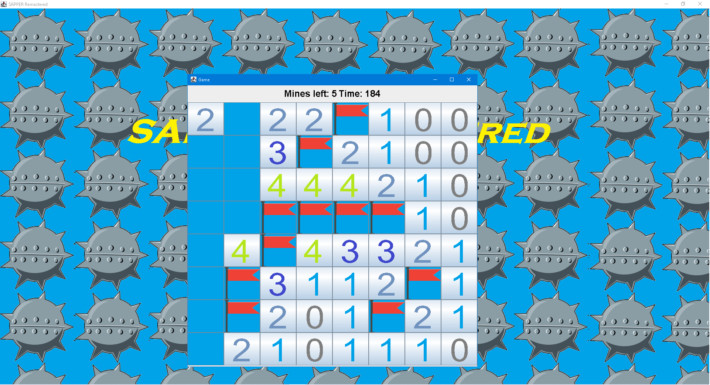
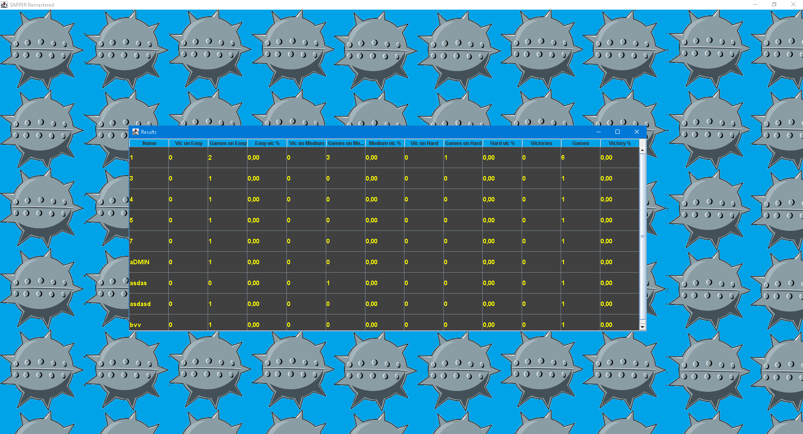

**SAPPER Remastered**
--------------------

[](http://kotlinlang.org)

## **Developer**
[Paranid5](https://github.com/dinaraparanid)

## **About project**
This project is a remaster of my old Sapper game (console version on C language).
You can try it [here](https://github.com/dinaraparanid/Sapper)

Game has 4 types of levels:
1. Easy (8 x 8 and 16 mines)
2. Medium (16 x 16 and 64 mines)
3. Hard (32 x 32 and 256 mines)
4. Custom with your game settings (width, height and mines > 0)

### **Current status**
**V 1.1.1**

## **Gameplay**
As in classic sapper game from microsoft, you are trying to open as many cells as you can.
Numbers shows amount of mines in near cells. For example, it opened cell's number is 1,
than there is one mine in neighbour cells. You can put flags to show that there is a mine.

## **Setup and Run**
```shell
git clone https://github.com/dinaraparanid/SapperRemastered.git
cd SapperRemastered
java -jar Sapper_PC-V1.1.1.jar
```

## **Preview**







## **Stack**

<ul>
    <li>Kotlin 1.9</li>
    <li>Swing + Java.AWT</li>
    <li>Coroutines + StateFlow + Swing extensions</li>
    <li>Exposed ORM + JDBC</li>
    <li>Arrow</li>
</ul>

## **Credits**
Main menu soundtrack is *"Transcendental"
(Bonus Track for X3 Albion Prelude Game) by [Alexei Zakharov](https://soundcloud.com/alexeizakharov)*.

## **License**
*GNU Public License V 3.0*