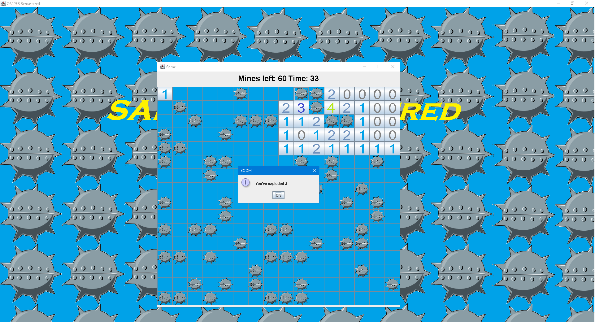

*SAPPER Remastered*
--------------------

Author
--------------------
dinaraparanid (Follow on GitHub: https://github.com/dinaraparanid)

About project
--------------------
This project is a remaster of my old Sapper game (console version on C language).
You can check it here: https://github.com/dinaraparanid/Sapper

Game has 4 types of levels:
1. Easy (8 x 8 and 16 mines)
2. Medium (16 x 16 and 64 mines)
3. Hard (32 x 32 and 256 mines)
4. Custom with your game settings (width, height and mines > 0)

Gameplay
--------------------
As in classic sapper game from microsoft, you are trying to open as many cells as you can.
Numbers shows amount of mines in near cells. For example, it opened cell's number is 1,
than there is one mine in neighbour cells. You can put flags to show that there is a mine.

Setup and Run
--------------------
Setup projects from github (just click on Code, Download Zip). 
After downloading, put all files to some folder, 
press run.exe and game will start.

Credits
--------------------
Main menu song is *"Transcendental" 
(Bonus Track for X3 Albion Prelude Game) by Alexei Zakharov*.
Follow him here: https://soundcloud.com/alexeizakharov

Screenshots
--------------------

Enjoy!
--------------------